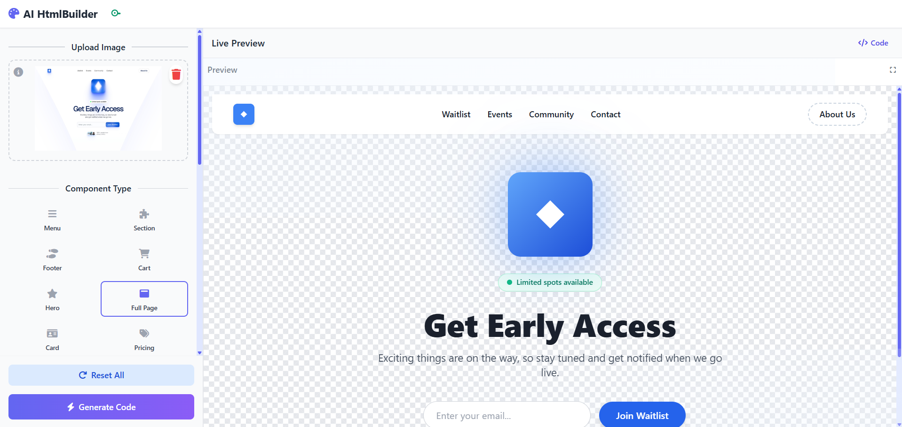

# AI HtmlBuilder 🚀

AI HtmlBuilder is an innovative web application that transforms your visual mockups into functional HTML and Tailwind CSS code in seconds. Powered by Google's Gemini AI, you can go from design to code faster than ever.

## Overview

<table>
  <tr>
    <td align="center"><strong>Generated Code View</strong></td>
    <td align="center"><strong>Live Preview</strong></td>
  </tr>
  <tr>
    <td></td>
    <td></td>
  </tr>
</table>

## ✨ Features

- **Image-to-Code Transformation:** Upload an image (JPG, PNG, etc.) of your design.
- **Intelligent Generation:** Specify the component type (e.g., `Header`, `Hero`, `Full Page`) for more semantic code.
- **Live Editing:** Edit the generated code directly in the integrated editor and see the changes reflected instantly in the preview.
- **Dual View:** View the HTML/Tailwind code and its live render side-by-side.
- **API Key Management:** Configure your API key directly through the UI or via environment variables.
- **Fast and Efficient:** Built with React, Vite, and the Gemini API for optimal performance.

## 🛠️ Tech Stack

- **Frontend:** [React](https://react.dev/) & [TypeScript](https://www.typescriptlang.org/)
- **Build Tool:** [Vite](https://vitejs.dev/)
- **Styling:** [Tailwind CSS](https://tailwindcss.com/)
- **AI:** [Google Gemini API](https://ai.google.dev/)
- **Code Editor:** [CodeMirror](https://codemirror.net/)

## 🚀 Getting Started

Follow these steps to run the project locally.

### Prerequisites

- [Node.js](https://nodejs.org/) (version 18.x or higher)
- [npm](https://www.npmjs.com/)

### Installation

1.  Clone the repository:
    ```bash
    git clone https://github.com/your-username/your-repo.git
    ```
2.  Navigate to the project directory:
    ```bash
    cd ai-htmlbuilder
    ```
3.  Install the dependencies:
    ```bash
    npm install
    ```

### Running the Development Server

To start the development server, run:

```bash
npm run dev
```

The application will be available at `http://localhost:5173` (or another port if it's in use).

### Building for Production

To create an optimized production build:

```bash
npm run build
```

The files will be generated in the `dist/` directory.

## 🔑 Gemini API Key Configuration

To use the application, you must provide your own Google Gemini API key. You have two options:

### 1. Via the User Interface (Recommended)

-   Get your API key from [Google AI Studio](https://aistudio.google.com/app/apikey).
-   In the application, click the key icon in the top left to enter and save your key. It will be stored securely in your browser's `localStorage`.

### 2. Via an Environment Variable

-   Create a `.env.local` file at the root of the project.
-   Add your API key as follows:
    ```
    VITE_GEMINI_API_KEY=YOUR_API_KEY_HERE
    ```
-   Restart the development server if it was running.

The application will prioritize the key set in the environment variables.